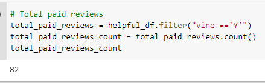
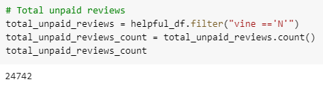
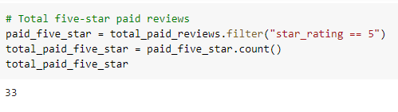
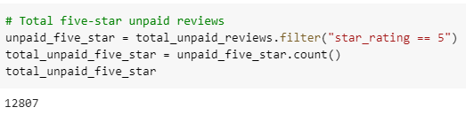
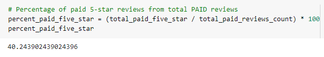
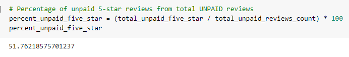

# Amazon_Vine_Analysis

## Overview
The purpose of this analysis was to analyze Amazon reviews written by members of the paid Amazon Vine program. The Amazon Vine program is a service that allows manufacturers and publishers to receive reviews for their products. Companies pay a small fee to Amazon and provide products to Amazon Vine members, who are then required to publish a review, though not all paid reviews are guaranteed to be 5 stars. For this particular analysis, the dataset of reviews for automotive products were examined. PySpark was the tool of choice used to perform the ETL process to extract the dataset, transform the data, connect to an AWS RDS instance, and load the transformed data into pgAdmin. PySpark/Pandas was then used to determine if there were any biases toward favorable reviews from Vine members in the automotive products reviews dataset.

## Results
The analysis on the Amazon automotive reviews lead to the following results:
- Out of a total of 24,824 total reviews, there were 82 total Vine reviews and 24,742 non-Vine reviews.

- Out of a total of 12,840 5 star reviews, 33 of them were Vine 5 star reviews and 12,807 of them were non-Vine 5 star reviews.

- Out of all the Vine reviews, approximately 40.24% of them were 5 star reviews.

- Out of all the non-Vine reviews, approximately 51.76% of them were 5 star reviews. 

## Summary
Based on the results, it appears that only a slight fraction (less than 1%) of all reviews were written by members of the paid Amazaon Vine program. Specifically, only 82 of the 24,824 total reviews were paid Vine program reviews. This indicates that there was minimal to no influence onto the dataset and therefore no positivity bias as a whole. In fact, not all of the 82 paid Vine reviews were even 5 star reviews. However, the percentage of 5 star reviews within the Vine reviews did have a higher rate. Of the total 82 Vine reviews, 33 of them were 5 star reviews, which is approximately 40%. Despite this higher rate, the paid 5 star reviews still do not reflect the overwhelming majority of the paid Vine reviews, and thus indicates that there is no conclusive evidence that there is positivity bias. Ovreall, it appears that the integrity of the reviews for these automotive products are fair and not influenced to be biased.

An additional analysis that could be run on this dataset is to determine the number of Vine (paid) and non-Vine (unpaid) 4 star reviews as well. Although 5 stars is the most favorable and highest excellence of rating, 4 star reviews would still be considered above average. It is possible that there may be more paid Vine 4 star reviews to help boost the perception of the products. In this case, an argument could be potentially made that there is positivity bias. However, it would still be very minimal due to the low percentage of Vine reviews overall when compared to non-Vine program reviews for this particular product dataset. 
